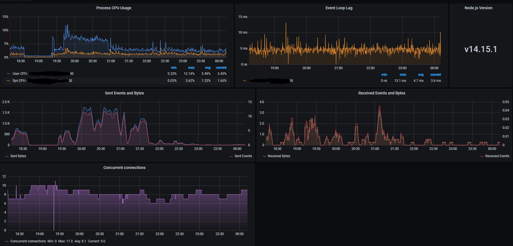

# socket.io-prometheus-v3

Exposes metrics endpoints for prometheus to collect data about socket.io v3.

## Installation
```
$ npm i socket.io-prometheus-v3
```

## Usage 
```
const { PrometheusSocketIo } = require('socket.io-prometheus-v3')
const prometheus = PrometheusSocketIo.init({ 
    io, // io.Server
    collectDefaultMetrics: false // Collect some Node.js-specific metrics.
})

...

// Serve your metrics with express or whatever http server
app.get('/metrics', async (req, res) => {
    res.send(await prometheus.getMetrics())
}) 
```

## Grafana
You can find a ready-to-use Grafana dashboard in "dashboards". 

For it to be fully complete, you need to activate the collectDefaultMetrics property that retrieves the metrics from your Node.js application.


